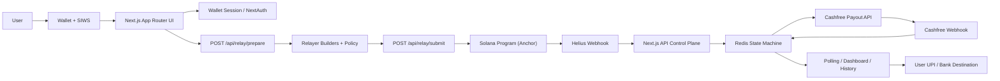

# RailFi Enterprise Architecture

## Executive Overview

RailFi is a zero-custody, gasless B2B2C settlement layer that turns USDC balances on Solana into Indian UPI payouts through a controlled server-side relayer and an asynchronous fiat payout rail. The system is designed to minimize bank-risk and custody risk: user assets remain under user-controlled wallet signatures until they move into a program-derived vault, all settlement authorizations are enforced on-chain, and fiat execution is performed only after confirmed on-chain intent has been durably recorded.

At a systems level, RailFi combines:

- a Solana Anchor program for vault escrow, quote locking, referral accounting, and circuit-breaker enforcement
- a Next.js 14 App Router application that serves both the user interface and the serverless API control plane
- a hybrid identity model composed of Sign-in with Solana (SIWS), Redis-backed wallet sessions, and NextAuth/Google linking
- Redis-backed operational state for high-throughput settlement workflows, webhook ingestion, idempotency, and rate limiting
- a Prisma-backed durable identity layer for users, linked UPI handles, and long-lived auth sessions
- third-party network integrations including Helius, Pyth, Sumsub, Light Protocol, Kamino benchmarks, and Cashfree

RailFi should be understood as a settlement orchestration system, not a custodial wallet or bank. The frontend expresses user intent, the relayer prepares and submits constrained transactions, the on-chain program enforces the invariant set, and the webhook/state machine layer resolves asynchronous payout completion.

## System Architecture

## Monorepo Topology

- `contract/`
  - Anchor/Rust Solana program
  - defines `ProtocolConfig`, `UserVault`, `OfframpRequest`, `ReferralConfig`, and `CircuitBreaker`
  - enforces relayer authority, KYC authority, canonical Pyth feed usage, fee accounting, and rolling-window outflow protection
- `frontend/`
  - Next.js 14 App Router application
  - includes public pages, authenticated dashboard surfaces, profile and invoice flows, demo paths, and all serverless/API routes
  - hosts the relayer entrypoints, webhook listeners, analytics APIs, KYC endpoints, and hybrid auth surface

## Control Plane and Runtime Boundaries

RailFi intentionally concentrates orchestration logic in the Next.js API surface so that browser code remains a presentation and signature layer.

### Browser responsibilities

- collect user inputs such as UPI destination, amount, and referral context
- request gasless prepared transactions from `/api/relay/prepare`
- sign transactions client-side with the connected wallet
- submit signed transactions to `/api/relay/submit`
- poll status endpoints for payout completion and history hydration

### Server/API responsibilities

- validate origin and rate limits for mutable endpoints
- stage payout metadata keyed to the exact serialized relay transaction
- re-validate submitted transactions against relayer policy before broadcast
- confirm on-chain execution before initiating fiat payout
- persist canonical payout state before any asynchronous Cashfree call
- process Helius and Cashfree webhooks into Redis-backed state machines
- aggregate analytics, wallet intelligence, profile, tax export, and benchmark data

### On-chain responsibilities

- maintain protocol configuration and trusted authorities
- custody USDC inside program-owned vault ATAs
- persist immutable offramp receipts with quote metadata and hashed payout destination
- enforce fee collection, referral accounting, and circuit-breaker policy
- mint compressed receipt metadata through Bubblegum-compatible paths

## Core Settlement Flow

### 1. Identity and session establishment

RailFi currently supports a hybrid auth model:

- legacy wallet sessions
  - browser signs a deterministic SIWS-style message
  - `/api/auth/wallet/session` verifies the signature server-side
  - session records are stored in Redis under `railfi:wallet-session:*`
  - the cookie is refreshed opportunistically for active users
- NextAuth/Auth.js
  - Google OAuth provider
  - Credentials provider for Solana wallet signatures
  - session shape is extended with `walletAddress`, `kycTier`, `walletLinked`, and `googleLinked`
  - linking routes allow wallet-first and Google-first identity convergence

This dual model exists because the application is migrating from a wallet-session-only model into a hybrid Web2/Web3 trust layer without breaking current dashboard and settlement flows.

### 2. Relay preparation

`POST /api/relay/prepare` is the first mutable settlement endpoint.

It performs:

- trusted-origin enforcement for non-GET methods
- IP rate limiting
- prepared transaction construction through relayer builders
- policy validation against allowed program actions
- payout metadata staging for `trigger_offramp`

For payout staging, RailFi stores the user wallet, plaintext UPI ID, USDC amount, INR quote, and optional referral key in Redis using a digest of the serialized transaction. This is what later allows `/api/relay/submit` to map a confirmed Solana signature to a Cashfree transfer without relying on the browser to replay any payout metadata.

### 3. Relay submission

`POST /api/relay/submit` is the execution-critical control point.

It performs:

- origin enforcement and rate limiting per IP and wallet
- full transaction re-validation through `validateRelayRequest`
- pre-broadcast simulation
- raw transaction submission to the configured RPC
- `confirmed` commitment confirmation

After confirmation:

- the staged payout payload is consumed exactly once
- a canonical `transferId` is derived from the confirmed signature
- a durable `OfframpRecord` is written synchronously to Redis before fiat initiation
- the Cashfree payout is fired asynchronously

The canonical offramp record contains:

- `transferId`
- `solanaTx`
- `cashfreeId`
- `walletAddress`
- `amountUsdc` and `amountMicroUsdc`
- `amountInr` and `amountInrPaise`
- masked and hashed UPI information
- `status`
- `utr`
- timestamps
- `requiresReview`
- `referralPubkey`

This is the system-of-record for payout lifecycle tracking inside the application tier.

### 4. On-chain execution

The Anchor program in `contract/programs/railpay-contract` provides the enforcement layer.

#### Primary accounts

- `ProtocolConfig`
  - admin
  - relayer authority
  - USDC mint
  - Merkle tree
  - KYC authority
  - oracle max age
  - Kamino benchmark flag
- `UserVault`
  - owner
  - hashed UPI handle
  - cumulative received/offramped balances
  - receipt counter
  - active flag
- `OfframpRequest`
  - user
  - vault
  - USDC amount
  - INR quote
  - receipt id
  - hashed destination UPI
  - timestamp
  - locked Pyth price
  - exponent, confidence, and lock time
- `ReferralConfig`
  - referrer
  - fee basis points
  - total earned and total referred counters
- `CircuitBreaker`
  - authority
  - max outflow per window
  - window duration
  - current outflow
  - tripped state
  - trip count

#### Critical on-chain invariants

- relayer fee payer must equal `protocol_config.relayer_authority`
- KYC signer must equal `protocol_config.kyc_authority`
- the Pyth price account is checked against the canonical USDC/USD feed
- stale prices are rejected using `oracle_max_age`
- wide confidence intervals are rejected
- total deducted amount includes protocol fee and optional referral fee
- circuit-breaker windows roll forward and trip on abnormal outflow
- destination UPI is hashed before it ever reaches on-chain state

### 5. Fiat payout initiation

The Cashfree service layer in `src/services/cashfree/payout.ts` performs:

- token authorization against Cashfree and Redis token caching
- beneficiary creation
- payout transfer initiation in UPI mode
- fallback polling of transfer status
- payout record persistence alongside canonical offramp records

The service caches bearer auth tokens in Redis and writes payout snapshots into:

- `offramp:payout:{transferId}`
- `offramp:payout:wallet:{walletAddress}`
- transaction-staged payout preparation keys keyed by serialized transaction hash

### 6. Webhook reconciliation

#### Cashfree webhook

`POST /api/webhooks/cashfree`

- reads the raw body first
- verifies `x-webhook-signature` using HMAC-SHA256 and `CASHFREE_CLIENT_SECRET`
- parses payload after signature verification
- extracts transfer identifiers, status, and UTR
- updates the canonical offramp record
- writes unknown transfer webhooks into `offramp:dlq:{transferId}`
- returns `200` for processed or orphaned valid-signature events
- returns `401` for invalid signatures

This route is the final payout-state reconciliation point and is the primary source of `SUCCESS`, `FAILED`, `REVERSED`, and `REQUIRES_REVIEW` transitions.

#### Helius webhook

`POST /api/webhooks/helius`

- authenticated with `HELIUS_WEBHOOK_SECRET`
- rate limited at the API edge
- appends the raw event batch to a Redis event log
- decodes relevant RailFi instructions from program transactions
- persists wallet-scoped webhook archive records
- attempts asynchronous compression through `/api/compress-offramp`
- exposes a session-protected `GET` path for users to inspect their webhook/compression history

This webhook is used for observability, history, and compression/archive workflows rather than fiat payout completion.

## Data and State Management

RailFi uses a hybrid state model optimized for throughput, recovery, and migration safety.

### Redis: hot-path operational state

Redis is the primary operational state backend for:

- wallet sessions
- webhook event archives
- payout preparation staging
- canonical offramp records
- wallet-scoped offramp indexes
- dead-letter webhook queue
- profile flags
- linked UPI handle lists
- KYC/compliance records
- daily and monthly usage counters
- Cashfree token cache
- rate-limit buckets
- demo-mode flow state
- invoice storage and creator indexes

This split is intentional. These paths benefit from:

- low-latency read/write semantics
- TTL-based lifecycle management
- simple keyed idempotency
- resilience for asynchronous webhook/event flows

### Prisma and SQL: durable identity state

Prisma is present for durable user and session data:

- `User`
- `UpiHandle`
- `OfframpTransaction`
- `Account`
- `Session`
- `VerificationToken`

Important implementation note:

- the current repo’s Prisma datasource is configured as `sqlite`
- the schema and access layer are SQL-backed and can be promoted to managed Postgres in production without changing the application boundary

In practice, the current system already behaves like a split-brain control plane:

- Redis handles operational state and event throughput
- Prisma handles long-lived identity and account linkage

### Idempotency and deduplication strategy

RailFi uses several idempotency keys and one-time state boundaries:

- serialized-transaction digest for prepared payout staging
- Solana signature-derived `transferId` as the canonical offramp key
- Cashfree transfer identifiers written back onto the canonical record
- webhook DLQ by `transferId` for orphaned events
- Redis nonce consumption for wallet-session auth replay protection

## Security and Compliance Posture

### Zero-custody operating model

RailFi is designed around minimized custody:

- wallet signatures remain client-side
- server APIs never receive private keys from end users
- vault movement is program-validated, not UI-trusted
- payout destinations are hashed on-chain
- server-side relayer keys are isolated to signing permitted gasless transactions only

### Authentication and trust layers

- SIWS-style wallet signatures for native crypto auth
- Redis-backed wallet sessions for current production UX
- NextAuth with Google + Solana credential provider for hybrid identity
- session hydration exposes trust signals (`walletLinked`, `googleLinked`, `kycTier`)

### Webhook security

- Cashfree webhook: HMAC verification with timing-safe comparison
- Sumsub webhook: signed payload verification before attestation issuance
- Helius webhook: shared-secret authorization header validation

### API abuse controls

Rate limiting is enforced centrally via Upstash Redis across:

- relay prepare and submit
- KYC token and status requests
- invoice creation and reads
- analytics and yield reads
- validation endpoints
- webhook routes
- wallet session auth

This creates consistent abuse protection without embedding ad hoc throttling logic into individual routes.

### Circuit breaker and quote integrity

The program-level circuit breaker is the last-line protection against abnormal outflow velocity. Separately, Pyth quote validation ensures that off-chain UI display cannot bypass:

- feed identity checks
- staleness bounds
- confidence width bounds

### Compliance lifecycle

KYC is integrated through Sumsub and Light Protocol:

- users request KYC access tokens via wallet-authenticated routes
- approvals are reflected in Redis compliance records
- approved users receive a compressed on-chain compliance attestation
- profile limits are derived from approved tier state

## Frontend Architecture

### Provider model

The frontend uses a singleton context pattern:

- `Providers` installs React Query, Wallet Adapter, Toast, Wallet Session, and `RailpayProvider`
- `RailpayProvider` wraps `useRailpay()`
- `useRailpay()` composes protocol, balance, vault, and action hooks into a single facade

This reduces repeated PDA/config derivation across pages and keeps mutation state centralized.

### Rendering strategy

- App Router with a mix of public and dashboard groups
- dashboard pages are interactive client surfaces
- yield uses a static shell with a hydrated client that fetches `/api/yield`
- stats is a public server component that combines analytics API reads with direct Helius reads

### UI surface domains

- landing and login: public acquisition and wallet entry
- dashboard: balances, transfer flow, history, analytics, yield
- public invoice route: third-party settlement checkout
- profile: operational identity, KYC, handles, and trust markers
- demo: deterministic end-to-end sandbox without waiting on live payout rails

## Payout Lifecycle

### Happy path

1. User connects wallet and establishes a wallet session.
2. User composes an offramp request with amount, UPI ID, and optional referral.
3. `/api/relay/prepare` builds a constrained transaction and stages payout metadata.
4. Browser signs the prepared transaction.
5. `/api/relay/submit` re-validates, simulates, submits, and confirms the transaction.
6. The server writes a canonical `OfframpRecord`.
7. Cashfree beneficiary and transfer APIs are called asynchronously.
8. The UI polls `/api/offramp/status/[transferId]` or payout-status routes for interim state.
9. Cashfree webhook arrives with a signed status payload.
10. Canonical payout state is updated with status and UTR.
11. Dashboard, profile, history, and exports reflect final settlement state.

### Unhappy paths and fallback behavior

#### Before broadcast

- invalid origin -> request rejected
- rate limit exceeded -> request rejected
- malformed request body -> request rejected
- relayer policy violation -> request rejected
- stale blockhash or expired tx -> `409`
- simulation failure -> descriptive client-safe error

#### After on-chain confirmation but before fiat completion

- prepared payout missing -> transaction still confirmed, but no payout initiation occurs
- Cashfree auth or transfer call fails -> offramp marked failed/reviewable
- user can continue observing the on-chain receipt while fiat resolution is investigated

#### Webhook stage

- invalid Cashfree signature -> `401`
- missing transfer ID -> acknowledged but ignored
- unknown transfer ID -> raw payload moved to DLQ for manual reconciliation
- failed/reversed payout -> canonical record escalates to `REQUIRES_REVIEW`

#### Analytics/yield degradation

- analytics failures return `502` instead of partial unsafe data
- yield API returns a benchmark fallback snapshot and sets `X-RailFi-Yield-Fallback`
- stats page falls back to direct analytics generation if app-url fetch fails during prerender

#### KYC degradation

- Sumsub upstream failure -> `502`
- demo mode can auto-approve for sandbox walkthroughs
- Light validity proof indexing delays are modeled explicitly as `approved_indexing`

## Tech Stack

### Frontend

- Next.js 14 App Router
- React 18
- Tailwind CSS with tokenized design variables
- React Query for client caching
- Solana Wallet Adapter
- Vercel Analytics

### Backend / API plane

- Next.js serverless route handlers
- Node and Edge runtimes chosen per route
- origin enforcement, cookie/session management, and edge validation APIs

### Data / state

- Upstash Redis for high-throughput state, rate limiting, idempotency, session cache, and webhook/archive storage
- Prisma for durable user, UPI, and auth session models
- SQL-backed Prisma schema, currently configured to SQLite in-repo and structurally ready for managed Postgres deployment

### Web3 and protocol layer

- Solana Web3.js
- Anchor 0.29
- Pyth receiver SDK / Hermes clients
- Light Protocol stateless compression
- Helius enhanced webhooks, transaction history, and DAS reads
- Kamino benchmark integration for yield modeling

### Payout and compliance partners

- Cashfree for UPI payouts
- Sumsub for KYC identity and review state

## Operational Notes

- The contract program ID is fixed on Devnet and used by both frontend and program tooling.
- The program config seed is `protocol_config_v2`, reflecting a migration away from a stale layout.
- The current repo contains both legacy wallet-session auth and newer NextAuth hybrid auth intentionally.
- The repo uses Redis as the settlement system-of-record today even though Prisma includes an `OfframpTransaction` model; the relational payout migration is staged but not yet the live hot path.

## Conclusion

RailFi is architected as a composable settlement system with three strong properties:

1. user intent is signed locally and validated at every boundary
2. asynchronous fiat execution is durably reconciled through Redis-backed state machines and signed webhooks
3. trust is built progressively through KYC attestations, hybrid identity, and on-chain verifiability rather than through custodial abstraction

That combination gives RailFi a credible path from Devnet MVP to a production-grade settlement network: the separation between UI, orchestration, enforcement, and reconciliation is already present in the codebase, and each layer can scale independently without changing the core trust model.
