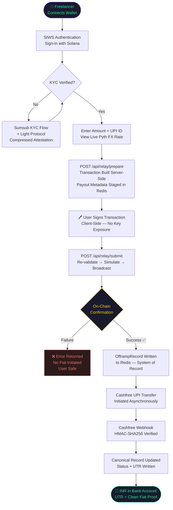
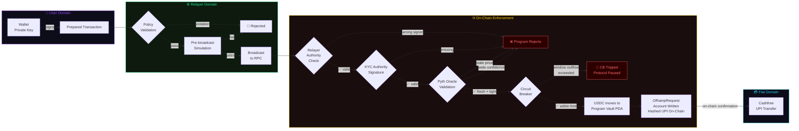

<div align="center">

```
██████╗  █████╗ ██╗██╗     ███████╗██╗
██╔══██╗██╔══██╗██║██║     ██╔════╝██║
██████╔╝███████║██║██║     █████╗  ██║
██╔══██╗██╔══██║██║██║     ██╔══╝  ██║
██║  ██║██║  ██║██║███████╗██║     ██║
╚═╝  ╚═╝╚═╝  ╚═╝╚═╝╚══════╝╚═╝     ╚═╝
```

### **The Gasless Settlement Superconductor**
*USDC → Solana → UPI. Atomic. Trustless. Instant.*

---

[](https://solana.com)
[](https://nextjs.org)
[](https://anchor-lang.com)
[](https://upstash.com)
[](LICENSE)
[](https://explorer.solana.com)

</div>

---

## ⚡ 60-Second Pitch

> **Problem:** Indian freelancers earning in USDC face a silent crisis. Converting crypto → INR through P2P exchanges deposits "dirty fiat" — money flagged by banks as suspicious — directly into their accounts. The result: **bank accounts frozen without warning.** No recourse. No timeline. Career-ending.

> **Solution:** RailFi is a **zero-custody, gasless settlement layer** that converts USDC on Solana into UPI bank payouts — atomically, transparently, and with every rupee traceable to a signed on-chain receipt. No P2P. No dirty fiat. No frozen accounts.

> **Why Solana?** 400ms block times and sub-$0.001 transaction fees make real-time FX settlement economically viable for amounts as small as $5. No other chain makes this possible at the user level.

---

## 🔥 The Problem: Dirty Fiat is Destroying Indian Freelancers

The Indian freelance economy earns in dollars. Banks settle in rupees. The gap between those two realities is filled by **P2P crypto markets** — and that gap is a minefield.

When a freelancer sells USDC on a P2P platform, they receive INR from a random counterparty's bank account. That counterparty may have purchased their crypto with proceeds from gambling, fraud, or money laundering. The freelancer has **no way to know**. But their bank does.

The result is a cascade:

| Stage | What Happens |
|-------|-------------|
| 🟡 P2P Sale | Freelancer receives INR from unknown source |
| 🔴 Bank Flags | Incoming transaction marked as suspicious |
| 🔒 Account Freeze | Account frozen, sometimes for months |
| 💸 Income Lost | Salary, bills, EMIs — all blocked |
| 📉 No Recourse | Bank offers no timeline, no explanation |

**RailFi eliminates the counterparty entirely.** Settlement flows from a KYC-verified on-chain vault through an authorised payout processor (Cashfree) directly to the user's UPI handle. Every rupee has a Solana transaction hash as its origin story.

---

## 🚀 The Solution: Gasless Settlement Superconductor

RailFi replaces the P2P gap with a **three-layer settlement architecture**:

```
USER WALLET ──► ANCHOR PROGRAM ──► CASHFREE UPI ──► BANK ACCOUNT
   (sign)         (enforce)          (execute)         (settle)
```

1. **Zero Gas for Users** — A server-side relayer pays all Solana transaction fees. Users sign; they never need SOL.
2. **On-Chain Enforcement** — An Anchor program locks USDC in a program-derived vault, validates Pyth oracle prices, and enforces circuit breakers before any fiat moves.
3. **Regulated Fiat Rail** — Cashfree (a licensed payment aggregator) handles the INR disbursement. Every payout has a UTR number — the same reference banks use to validate legitimate transfers.
4. **Immutable Receipt** — The `OfframpRequest` account on Solana is the permanent, auditable proof of every settlement. Your CA will love it.

---

## 🗺️ User Journey: USDC → INR in Your Bank



---

## 🛡️ Security Architecture: Circuit Breaker & Zero-Custody Model



**Every settlement passes through 5 independent validation checkpoints before a single rupee moves.**

---

## 🏗️ Enterprise Tech Stack

<table>
<tr>
<td width="50%">

### 🖥️ Frontend
| Technology | Role |
|-----------|------|
| **Next.js 14 App Router** | Full-stack framework, SSR + serverless APIs |
| **React 18** | Component model + concurrent features |
| **Solana Wallet Adapter** | Multi-wallet connect (Phantom, Backpack, etc.) |
| **React Query** | Client-side state, polling, cache invalidation |
| **Tailwind CSS** | Tokenised design system |
| **Vercel Analytics** | Real-user performance monitoring |

### 🗄️ Data & State
| Technology | Role |
|-----------|------|
| **Upstash Redis** | Hot-path state, sessions, rate limiting, idempotency |
| **Prisma ORM** | Durable identity: users, UPI handles, sessions |
| **SQLite → Postgres** | Schema-ready for production promotion |

</td>
<td width="50%">

### ⛓️ Web3 & Protocol
| Technology | Role |
|-----------|------|
| **Anchor 0.29 / Rust** | On-chain program: vault, circuit breaker, receipts |
| **Pyth Network** | Real-time USDC/USD oracle with staleness checks |
| **Helius** | Enhanced webhooks, transaction history, DAS |
| **Light Protocol** | Compressed on-chain KYC attestations |
| **Kamino Finance** | Yield benchmark data for analytics |

### 🔗 Compliance & Payments
| Technology | Role |
|-----------|------|
| **Cashfree Payouts** | Licensed UPI disbursement rail |
| **Sumsub** | KYC/AML identity verification |
| **HMAC-SHA256** | Webhook signature verification (all providers) |
| **Upstash Rate Limiting** | Centralised API abuse protection |

</td>
</tr>
</table>

---

## 🤖 Agentic Architecture: Built with a Multi-AI Stack

RailFi wasn't just built *with* AI tools — it was **architected through an agentic multi-model workflow** where each AI played a distinct role suited to its strengths.

```
┌─────────────────────────────────────────────────────────┐
│              RAILFI MULTI-AI DEVELOPMENT STACK          │
├──────────────┬──────────────────────┬───────────────────┤
│   GEMINI     │      CLAUDE          │      CODEX        │
│              │                      │                   │
│ System-level │ Architecture review  │ Implementation    │
│ design &     │ security invariants  │ acceleration &    │
│ product      │ & API contract       │ boilerplate       │
│ reasoning    │ specification        │ generation        │
│              │                      │                   │
│ "What should │ "How should this     │ "Write this       │
│  we build?"  │  be structured?"     │  function."       │
└──────────────┴──────────────────────┴───────────────────┘
```

| Model | Primary Contribution |
|-------|---------------------|
| **Google Gemini** | High-level system design, product architecture decisions, user journey mapping, and cross-component reasoning across the full monorepo context |
| **Anthropic Claude** | Security model review, API contract specification, architecture documentation (this file), edge case analysis for circuit breaker and webhook reconciliation logic |
| **OpenAI Codex** | Accelerated implementation of repetitive but precise code paths: Redis key schema, Anchor account validation boilerplate, Next.js route handler scaffolding |

This division mirrors how engineering teams operate at scale: product/system thinking, architecture review, and implementation acceleration are distinct cognitive modes — and distinct AI strengths.

---

## 🔒 Security First: Zero-Custody by Design

RailFi is architected so that **no single point of compromise can drain user funds.**

### The Zero-Custody Guarantee

```
What RailFi NEVER does:              What RailFi ALWAYS does:
─────────────────────────            ──────────────────────────
✗ Accept private keys                ✓ Validate signatures server-side
✗ Store plaintext UPI server-side    ✓ Hash UPI destinations on-chain
✗ Move funds without on-chain proof  ✓ Require confirmed tx before fiat
✗ Trust browser-supplied metadata    ✓ Stage + re-validate payout data
✗ Issue payouts without KYC          ✓ Enforce KYC authority in program
```

### The Circuit Breaker

The `CircuitBreaker` account on Solana is the protocol's **last line of defence against abnormal outflow**.

```
max_outflow_per_window: u64    ← Maximum USDC that can leave in one window
window_duration: i64           ← Rolling time window (configurable)
current_outflow: u64           ← Accumulated outflow in current window
tripped: bool                  ← When true: ALL settlements halt
trip_count: u64                ← Audit trail of trigger events
```

If outflow velocity exceeds the configured threshold — whether due to an exploit, oracle manipulation, or operational error — **the circuit breaker trips on-chain**. No server action required. The program rejects all subsequent settlement instructions until the authority resets the breaker.

### Webhook Security

Every inbound webhook is cryptographically verified before state mutation:

| Provider | Verification Method |
|----------|-------------------|
| Cashfree | HMAC-SHA256 with `CASHFREE_CLIENT_SECRET`, timing-safe comparison |
| Sumsub | Signed payload verification before KYC attestation issuance |
| Helius | Shared-secret `Authorization` header validation |

---

## 📁 Repository Structure

```
railfi/
├── contract/
│   └── programs/railpay-contract/
│       ├── src/
│       │   ├── lib.rs              # Program entrypoint
│       │   ├── instructions/       # trigger_offramp, circuit_breaker, referral
│       │   └── state/              # ProtocolConfig, UserVault, OfframpRequest,
│       │                           # ReferralConfig, CircuitBreaker
│       └── Anchor.toml
└── frontend/
    ├── src/
    │   ├── app/
    │   │   ├── (dashboard)/        # Authenticated settlement surfaces
    │   │   ├── (public)/           # Landing, login, invoice checkout
    │   │   └── api/
    │   │       ├── relay/          # prepare + submit — settlement critical path
    │   │       ├── webhooks/       # cashfree + helius reconciliation
    │   │       ├── offramp/        # status polling, history, analytics
    │   │       ├── auth/           # SIWS wallet session + NextAuth
    │   │       └── kyc/            # Sumsub token + status
    │   ├── services/
    │   │   ├── cashfree/           # Payout API + token caching
    │   │   └── redis/              # All Redis key schema and accessors
    │   └── hooks/
    │       └── useRailpay.ts       # Unified protocol facade hook
    └── package.json
```

---

## ⚙️ Settlement Flow: The Happy Path (11 Steps)

```
1.  Wallet connect + SIWS authentication
2.  KYC verification via Sumsub + Light Protocol attestation
3.  User enters: amount (USDC), UPI handle, optional referral key
4.  POST /api/relay/prepare
    → builds constrained Anchor transaction
    → stages payout metadata keyed to tx digest in Redis
    → returns serialized transaction for client signing
5.  User signs transaction client-side (private key never leaves browser)
6.  POST /api/relay/submit
    → re-validates transaction against relayer policy
    → runs pre-broadcast simulation
    → submits to Solana RPC
    → awaits `confirmed` commitment
7.  On-chain: Anchor program enforces all invariants (see Security section)
8.  Server writes canonical OfframpRecord to Redis (system of record)
9.  Cashfree beneficiary creation + UPI transfer initiated (async)
10. Cashfree webhook arrives → HMAC verified → UTR written to record
11. Dashboard reflects final state: amount, UTR, Solana explorer link
```

---

## 🚦 Error Handling & Resilience

RailFi is designed to **fail safely at every boundary**:

| Failure Point | Behaviour |
|--------------|-----------|
| Invalid origin / rate limit | Request rejected; no state mutation |
| Relayer policy violation | Rejected before broadcast |
| Simulation failure | Descriptive error; no on-chain state |
| Stale blockhash | `409` returned; user retries safely |
| On-chain program reject | tx fails; Redis record never created; no fiat |
| Cashfree call fails | Record marked `REQUIRES_REVIEW`; on-chain receipt still valid |
| Unknown webhook event | Payload written to dead-letter queue for reconciliation |
| Reversed payout | Canonical record escalates to `REQUIRES_REVIEW` |
| Analytics failure | `502` — never returns partial unsafe data |
| Yield API unavailable | Returns benchmark fallback with `X-RailFi-Yield-Fallback` header |

---

## 🗓️ Roadmap

- [x] Anchor program with vault, circuit breaker, referral accounting
- [x] Gasless relayer with policy validation and simulation
- [x] Redis-backed settlement state machine
- [x] Cashfree UPI payout integration
- [x] Sumsub KYC + Light Protocol compressed attestations
- [x] HMAC-verified webhook reconciliation
- [x] Hybrid SIWS + NextAuth/Google identity
- [ ] Mainnet deployment with audited program
- [ ] Multi-currency oracle support (EUR/GBP offramp)
- [ ] B2B invoice settlement SDK
- [ ] Relational Postgres promotion for payout records
- [ ] Mobile PWA with push notifications for settlement status

---

## 🏁 Getting Started

```bash
# 1. Clone
git clone https://github.com/your-org/railfi.git
cd railfi

# 2. Install frontend dependencies
cd frontend && npm install

# 3. Configure environment
cp .env.example .env.local
# Fill in: HELIUS_API_KEY, CASHFREE_CLIENT_ID, CASHFREE_CLIENT_SECRET,
#          UPSTASH_REDIS_REST_URL, UPSTASH_REDIS_REST_TOKEN,
#          SUMSUB_SECRET_KEY, NEXTAUTH_SECRET

# 4. Build and deploy the Anchor program (Devnet)
cd ../contract
anchor build && anchor deploy --provider.cluster devnet

# 5. Run the frontend
cd ../frontend && npm run dev
# → http://localhost:3000
```

---

## 📜 License

MIT — see [LICENSE](LICENSE)

---

<div align="center">

**Built for the Indian freelance economy.**
*Every rupee deserves a clean origin story.*

[](https://solana.com)
[](https://cashfree.com)
[](https://sumsub.com)

</div>
