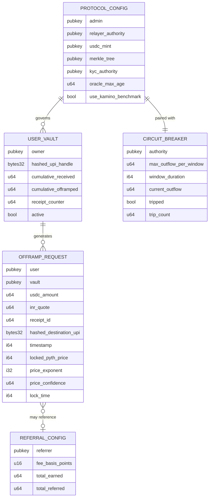
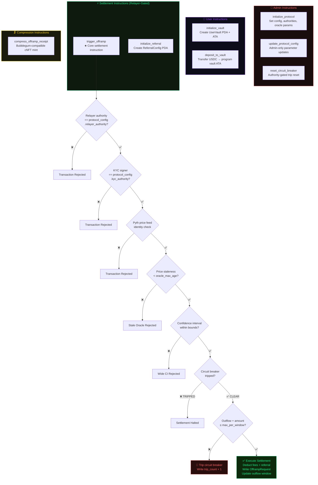
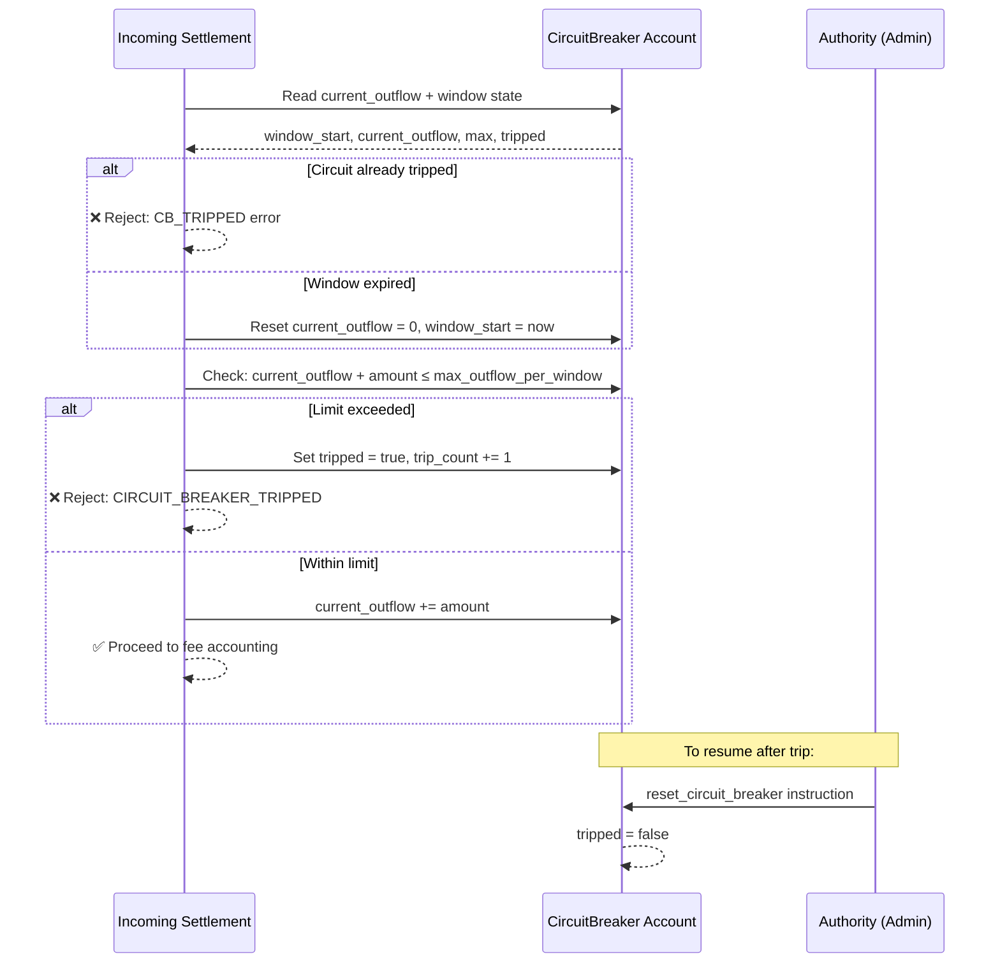

<div align="center">

```
 ██████╗ ███╗   ██╗      ██████╗██╗  ██╗ █████╗ ██╗███╗   ██╗
██╔═══██╗████╗  ██║     ██╔════╝██║  ██║██╔══██╗██║████╗  ██║
██║   ██║██╔██╗ ██║     ██║     ███████║███████║██║██╔██╗ ██║
██║   ██║██║╚██╗██║     ██║     ██╔══██║██╔══██║██║██║╚██╗██║
╚██████╔╝██║ ╚████║     ╚██████╗██║  ██║██║  ██║██║██║ ╚████║
 ╚═════╝ ╚═╝  ╚═══╝      ╚═════╝╚═╝  ╚═╝╚═╝  ╚═╝╚═╝╚═╝  ╚═══╝
```

### **The On-Chain Enforcement Layer**
*Vault escrow · Oracle validation · Circuit breaker · Referral accounting*

---

[](https://rust-lang.org)
[](https://anchor-lang.com)
[](https://solana.com)
[](https://pyth.network)
[](https://lightprotocol.com)
[](https://explorer.solana.com)

</div>

---

## What This Program Does

This is the `contract/` subrepo of the RailFi monorepo. It contains the **Anchor/Rust Solana program** that is the single source of truth for all settlement enforcement.

No USDC moves unless this program approves it. No fiat payout is valid without a confirmed instruction from this program. It is the **trust anchor** for the entire RailFi protocol.

**Core responsibilities:**
- Accept USDC into program-owned vault ATAs with user signatures
- Validate Pyth oracle prices for FX rate integrity at settlement time
- Write immutable `OfframpRequest` receipts with hashed payout destinations
- Enforce fee collection, referral splits, and protocol configuration
- Operate a rolling-window circuit breaker that halts settlement on abnormal outflow

---

## The Five On-Chain Accounts



---

## Instruction Set



---

## The `trigger_offramp` Instruction: Deep Dive

This is the **most critical instruction** in the protocol. Every validation listed below must pass or the transaction fails atomically — no partial state.

### Validation Checklist (in order)

```
SIGNER CHECKS
═══════════════
□  tx.fee_payer  == protocol_config.relayer_authority
   → Ensures only the authorised gasless relayer submits settlements
   → Users cannot self-submit and bypass policy

□  kyc_signer   == protocol_config.kyc_authority
   → Ensures KYC attestation is from the authorised issuer
   → Prevents fake KYC from untrusted signers

ORACLE CHECKS
═══════════════
□  price_feed.key == canonical USDC/USD Pyth feed address
   → Feed identity must match exactly — no substitute oracles

□  price.publish_time >= now - oracle_max_age
   → Stale prices rejected (default: 60 seconds)
   → Prevents exploitation of stale FX rates

□  price.conf / price.price <= MAX_CONFIDENCE_RATIO
   → Wide confidence intervals rejected
   → Prevents settlement during oracle uncertainty / thin markets

CIRCUIT BREAKER CHECKS
═══════════════════════
□  circuit_breaker.tripped == false
   → If tripped, ALL settlements halt until authority resets

□  Roll window if (now - window_start) > window_duration
   → Sliding window resets current_outflow

□  current_outflow + amount <= max_outflow_per_window
   → If exceeded: trip breaker, increment trip_count, reject tx

ACCOUNTING
═══════════════
□  protocol_fee   = amount * protocol_fee_bps / 10_000
□  referral_fee   = amount * referral_fee_bps / 10_000  (if referral provided)
□  user_receives  = amount - protocol_fee - referral_fee
□  total_deducted = protocol_fee + referral_fee + user_receives
   → Must equal original amount (no rounding loss)

STATE WRITES (only if all above pass)
════════════════════════════════════
□  Transfer USDC from user ATA → vault ATA
□  Transfer protocol fee → protocol fee ATA
□  Transfer referral fee → referrer ATA (if applicable)
□  Write OfframpRequest { amount, inr_quote, hashed_upi, price, timestamp }
□  Increment UserVault.cumulative_offramped + receipt_counter
□  Increment CircuitBreaker.current_outflow
□  Update ReferralConfig.total_earned + total_referred (if applicable)
```

### Why UPI is Hashed On-Chain

The `hashed_destination_upi` field stores a `sha256` digest of the UPI handle — **never the plaintext**. This gives:

1. **Privacy** — UPI IDs are not publicly readable from the Solana explorer
2. **Verifiability** — The server can prove a payout went to the claimed UPI by comparing hashes
3. **Immutability** — The destination is locked at the time of signing; no post-hoc modification

---

## Account Structures (Rust)

```rust
#[account]
pub struct ProtocolConfig {
    pub admin: Pubkey,
    pub relayer_authority: Pubkey,    // Must co-sign every settlement
    pub usdc_mint: Pubkey,
    pub merkle_tree: Pubkey,          // For Light Protocol compression
    pub kyc_authority: Pubkey,        // Must co-sign every settlement
    pub oracle_max_age: u64,          // Pyth staleness threshold (seconds)
    pub use_kamino_benchmark: bool,
}

#[account]
pub struct UserVault {
    pub owner: Pubkey,
    pub hashed_upi_handle: [u8; 32],  // sha256 of UPI ID
    pub cumulative_received: u64,     // Total USDC deposited (micro)
    pub cumulative_offramped: u64,    // Total USDC settled (micro)
    pub receipt_counter: u64,         // Monotonic receipt ID
    pub active: bool,
}

#[account]
pub struct OfframpRequest {
    pub user: Pubkey,
    pub vault: Pubkey,
    pub usdc_amount: u64,             // In micro-USDC (6 decimals)
    pub inr_quote: u64,               // Locked INR amount at time of signing
    pub receipt_id: u64,              // From UserVault.receipt_counter
    pub hashed_destination_upi: [u8; 32],
    pub timestamp: i64,
    pub locked_pyth_price: i64,       // Price at settlement time
    pub price_exponent: i32,
    pub price_confidence: u64,
    pub lock_time: i64,
}

#[account]
pub struct ReferralConfig {
    pub referrer: Pubkey,
    pub fee_basis_points: u16,        // e.g. 50 = 0.5%
    pub total_earned: u64,            // Cumulative referral fees earned
    pub total_referred: u64,          // Number of offramp events referred
}

#[account]
pub struct CircuitBreaker {
    pub authority: Pubkey,            // Can reset tripped state
    pub max_outflow_per_window: u64,  // USDC limit per window
    pub window_duration: i64,         // Window length in seconds
    pub current_outflow: u64,         // Accumulated in current window
    pub tripped: bool,                // When true: ALL settlements blocked
    pub trip_count: u64,              // Audit trail of trip events
}
```

---

## PDA Derivation

```
ProtocolConfig:   ["protocol_config_v2"]
UserVault:        ["user_vault", user_pubkey]
OfframpRequest:   ["offramp_request", user_pubkey, receipt_id_bytes]
ReferralConfig:   ["referral_config", referrer_pubkey]
CircuitBreaker:   ["circuit_breaker", protocol_config_pubkey]
Vault ATA:        getAssociatedTokenAddress(vault_pda, usdc_mint)
```

> **Note:** The seed `protocol_config_v2` reflects a migration from a previous layout (`protocol_config`). Both frontend and program tooling use `v2` exclusively.

---

## Circuit Breaker: The Last Line of Defence



**What trips the breaker?** Abnormal USDC outflow velocity within a rolling time window. This catches:
- Exploit attempts draining the vault rapidly
- Oracle manipulation enabling artificially large settlements
- Operational errors causing duplicate payouts

**Who resets it?** Only the `circuit_breaker.authority` — a dedicated admin key, not the relayer. This separation of keys means a compromised relayer cannot reset a tripped breaker.

---

## Fee Accounting Model

```
Settlement Amount:  1,000 USDC
                    ─────────────────────────────────
Protocol Fee:         10 USDC  (example: 100 bps / 1%)
Referral Fee:          5 USDC  (example:  50 bps / 0.5%) ← only if referral
                    ─────────────────────────────────
User Receives:       985 USDC  → converted to INR via locked Pyth price
                    ═════════════════════════════════
Total:             1,000 USDC  ← must equal input (enforced on-chain)
```

- Protocol fee goes to `protocol_config` fee ATA
- Referral fee goes to `referral_config.referrer` ATA
- All three transfers occur atomically in the same instruction
- If arithmetic doesn't reconcile: transaction fails

---

## Light Protocol: Compressed Receipts

After a successful `trigger_offramp`, the `compress_offramp_receipt` instruction mints a **compressed NFT receipt** via a Bubblegum-compatible path:

```
OfframpRequest account data
        ↓
Bubblegum cNFT leaf
        ↓
Merkle tree (merkle_tree in ProtocolConfig)
        ↓
User wallet (compressed on-chain proof of settlement)
```

This gives users a verifiable, on-chain, permanently compressed record of every settlement — usable for tax documentation, audit trails, and CA verification — at a fraction of the cost of a full NFT.

---

## Directory Structure

```
contract/
├── programs/
│   └── railpay-contract/
│       ├── src/
│       │   ├── lib.rs                  # Program entrypoint + instruction routing
│       │   ├── instructions/
│       │   │   ├── initialize.rs       # Protocol + vault initialisation
│       │   │   ├── trigger_offramp.rs  # ★ Core settlement instruction
│       │   │   ├── circuit_breaker.rs  # Trip logic + reset instruction
│       │   │   ├── referral.rs         # ReferralConfig init + accounting
│       │   │   └── compress.rs         # Light Protocol cNFT minting
│       │   ├── state/
│       │   │   ├── protocol_config.rs
│       │   │   ├── user_vault.rs
│       │   │   ├── offramp_request.rs
│       │   │   ├── referral_config.rs
│       │   │   └── circuit_breaker.rs
│       │   └── errors.rs               # Custom error codes
│       └── Cargo.toml
├── tests/
│   └── railpay-contract.ts             # Anchor TypeScript integration tests
├── Anchor.toml                         # Program ID + cluster config
└── Cargo.toml
```

*★ = Settlement-critical path*

---

## Build & Deploy

```bash
# Prerequisites: Rust, Solana CLI, Anchor CLI 0.29

# Install Anchor CLI
cargo install --git https://github.com/coral-xyz/anchor anchor-cli --tag v0.29.0

# Build program
anchor build

# Run tests (Devnet)
anchor test --provider.cluster devnet

# Deploy to Devnet
anchor deploy --provider.cluster devnet

# Verify program ID matches Anchor.toml
solana program show <PROGRAM_ID> --url devnet
```

### After Deploy

Copy the deployed program ID into `frontend/.env.local`:
```bash
NEXT_PUBLIC_PROGRAM_ID=<your_deployed_program_id>
```

The frontend derives all PDAs from this program ID at runtime.

---

## Error Codes

| Code | Name | Triggered When |
|------|------|----------------|
| `6000` | `InvalidRelayerAuthority` | Fee payer ≠ `protocol_config.relayer_authority` |
| `6001` | `InvalidKycAuthority` | KYC signer ≠ `protocol_config.kyc_authority` |
| `6002` | `InvalidPriceFeed` | Pyth feed key doesn't match canonical USDC/USD feed |
| `6003` | `StalePriceData` | `publish_time` older than `oracle_max_age` |
| `6004` | `PriceConfidenceTooWide` | Confidence interval exceeds max ratio |
| `6005` | `CircuitBreakerTripped` | `circuit_breaker.tripped == true` |
| `6006` | `OutflowWindowExceeded` | This transaction would trip the circuit breaker |
| `6007` | `ArithmeticOverflow` | Fee accounting doesn't reconcile to input amount |
| `6008` | `VaultNotActive` | `user_vault.active == false` |
| `6009` | `UnauthorizedReset` | Reset signer ≠ `circuit_breaker.authority` |

---

## Security Properties

| Property | How It's Enforced |
|----------|------------------|
| **Only relayer can submit settlements** | Signer check against `protocol_config.relayer_authority` |
| **Only KYC authority can attest** | Signer check against `protocol_config.kyc_authority` |
| **No stale FX rates** | Pyth `publish_time` checked against `oracle_max_age` |
| **No thin-market manipulation** | Confidence width bounded before settlement |
| **Abnormal velocity halts protocol** | Circuit breaker auto-trips on window overflow |
| **UPI destination is immutable** | Hashed at signing, stored on-chain, never plaintext |
| **Fee arithmetic is exact** | On-chain reconciliation: fees + user amount must equal input |
| **Compressed receipts are permanent** | Light Protocol cNFT on Solana — not deletable |

---

<div align="center">

**Part of the [RailFi](../README.md) monorepo.**

[](https://rust-lang.org)
[](https://anchor-lang.com)
[](https://pyth.network)

*The chain doesn't trust. It verifies.*

</div>
