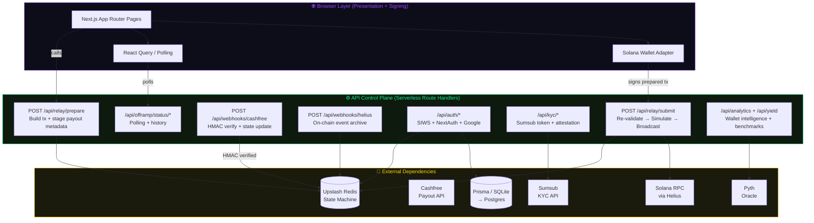
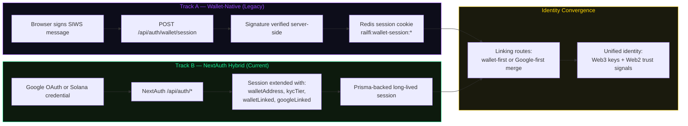

<div align="center">

```
██████╗  █████╗ ██╗██╗     ███████╗██╗    ███████╗██████╗  ██████╗ ███╗   ██╗████████╗███████╗███╗   ██╗██████╗
██╔══██╗██╔══██╗██║██║     ██╔════╝██║    ██╔════╝██╔══██╗██╔═══██╗████╗  ██║╚══██╔══╝██╔════╝████╗  ██║██╔══██╗
██████╔╝███████║██║██║     █████╗  ██║    █████╗  ██████╔╝██║   ██║██╔██╗ ██║   ██║   █████╗  ██╔██╗ ██║██║  ██║
██╔══██╗██╔══██║██║██║     ██╔══╝  ██║    ██╔══╝  ██╔══██╗██║   ██║██║╚██╗██║   ██║   ██╔══╝  ██║╚██╗██║██║  ██║
██║  ██║██║  ██║██║███████╗██║     ██║    ██║     ██║  ██║╚██████╔╝██║ ╚████║   ██║   ███████╗██║ ╚████║██████╔╝
╚═╝  ╚═╝╚═╝  ╚═╝╚═╝╚══════╝╚═╝    ╚═╝    ╚═╝     ╚═╝  ╚═╝ ╚═════╝ ╚═╝  ╚═══╝   ╚═╝   ╚══════╝╚═╝  ╚═══╝╚═════╝
```

### **Settlement UI + API Control Plane**
*The full-stack brain of the RailFi protocol.*

---

[](https://nextjs.org)
[](https://react.dev)
[](https://typescriptlang.org)
[](https://tailwindcss.com)
[](https://upstash.com)
[](https://solana.com)
[](https://vercel.com)

</div>

---

## What This Package Does

This is the `frontend/` subrepo of the RailFi monorepo. It is **not just a UI** — it is the full settlement orchestration layer for the RailFi protocol:

- **User Interface** — wallet connect, KYC flows, offramp dashboard, invoice checkout, yield analytics
- **API Control Plane** — the gasless relayer, webhook listeners, Redis state machine, auth surface, and compliance endpoints
- **Trust Boundary** — enforces origin policies, rate limits, relay validation, and payout staging before any on-chain or fiat action

The browser is a **presentation and signing surface only**. All settlement logic lives in the API routes on this side of the stack.

---

## Architecture: Two Apps in One Package



---

## Directory Structure

```
frontend/
├── src/
│   ├── app/
│   │   ├── (public)/               # Landing, login, public invoice checkout
│   │   ├── (dashboard)/            # Authenticated: balances, transfer, history
│   │   │   ├── dashboard/
│   │   │   ├── profile/            # KYC, UPI handles, identity trust markers
│   │   │   ├── analytics/          # Wallet intelligence, volume, export
│   │   │   ├── yield/              # Kamino benchmark yield display
│   │   │   └── demo/               # Sandboxed end-to-end demo (no live rails)
│   │   └── api/
│   │       ├── relay/
│   │       │   ├── prepare/        # ★ Build + stage gasless transaction
│   │       │   └── submit/         # ★ Re-validate, simulate, broadcast, confirm
│   │       ├── webhooks/
│   │       │   ├── cashfree/       # ★ HMAC-verified payout state reconciliation
│   │       │   └── helius/         # On-chain event archive + compression
│   │       ├── auth/
│   │       │   ├── wallet/         # SIWS wallet session endpoints
│   │       │   └── [...nextauth]/  # NextAuth: Google + Solana credential provider
│   │       ├── offramp/
│   │       │   ├── status/[id]/    # Polling endpoint for payout lifecycle
│   │       │   └── history/        # Wallet-scoped settlement history
│   │       ├── kyc/                # Sumsub token + status + attestation
│   │       ├── analytics/          # Aggregated wallet + protocol analytics
│   │       ├── yield/              # Kamino benchmark data + fallback
│   │       ├── invoice/            # Invoice creation, reads, public checkout
│   │       └── compress-offramp/   # Light Protocol compression trigger
│   ├── components/                 # Shared UI components
│   ├── hooks/
│   │   ├── useRailpay.ts           # ★ Unified protocol facade (balances, vault, actions)
│   │   ├── useWalletSession.ts     # Session hydration + refresh
│   │   └── useOfframpStatus.ts     # Polling + status transitions
│   ├── services/
│   │   ├── cashfree/
│   │   │   └── payout.ts           # ★ Cashfree API: token cache, beneficiary, transfer
│   │   └── redis/                  # All Redis key schema and read/write accessors
│   ├── lib/
│   │   ├── relayer/                # Transaction builders + policy validators
│   │   ├── auth/                   # Session validation, origin enforcement
│   │   └── rate-limit/             # Centralised Upstash rate limiting
│   └── types/                      # Shared TypeScript interfaces
├── prisma/
│   └── schema.prisma               # User, UpiHandle, OfframpTransaction, Session
├── public/
├── next.config.js
└── package.json
```

*★ = Settlement-critical path*

---

## The Two Critical API Routes

### `POST /api/relay/prepare` — The Staging Gate

This is the **first mutable settlement endpoint**. Nothing moves without passing through here.

```
Input:  { amount_usdc, upi_id, referral_key? }
          + authenticated wallet session

Actions:
  1. Enforce trusted origin header
  2. IP rate limit check (Upstash)
  3. Build constrained Anchor transaction via relayer builders
  4. Validate transaction against relayer policy whitelist
  5. Stage payout metadata in Redis keyed to sha256(serialized_tx):
       { wallet, upi_id, amount_usdc, inr_quote, referral_key }

Output: { serialized_transaction: base64 }
         → client signs this, never sees UPI metadata again
```

**Why staging matters:** The server never trusts browser-supplied payout metadata at submission time. The staged payload is the only source of truth for what UPI ID gets paid.

---

### `POST /api/relay/submit` — The Execution Gate

This is the **execution-critical control point**. Every line is load-bearing.

```
Input:  { signed_transaction: base64 }
          + authenticated wallet session

Actions:
  1. Enforce trusted origin + per-IP + per-wallet rate limits
  2. Full re-validation of transaction via validateRelayRequest()
  3. Pre-broadcast simulation against current chain state
  4. Raw transaction submission to configured Helius RPC
  5. Await `confirmed` commitment (not just `processed`)
  6. Consume staged payout payload exactly once (atomic pop)
  7. Derive canonical transferId from confirmed signature
  8. Write durable OfframpRecord to Redis synchronously
  9. Fire Cashfree payout asynchronously

Output: { transferId, solanaTx, status: "PENDING" }
```

**The atomic guarantee:** Steps 8 and 9 are ordered intentionally. The record exists before fiat is attempted. If Cashfree fails, the on-chain receipt is still valid and the record is marked `REQUIRES_REVIEW` for reconciliation.

---

## Redis State Machine: Key Schema

Redis is the **operational system of record** for all active settlements.

| Key Pattern | Contents | TTL |
|-------------|----------|-----|
| `railfi:wallet-session:{pubkey}` | Session token + metadata | Rolling |
| `offramp:staged:{tx_digest}` | Pre-signed payout metadata | Short (minutes) |
| `offramp:record:{transferId}` | Canonical OfframpRecord | Long |
| `offramp:wallet:{address}` | Index of wallet's transferIds | Long |
| `offramp:payout:{transferId}` | Cashfree payout snapshot | Long |
| `offramp:dlq:{transferId}` | Orphaned webhook payload | Manual review |
| `railfi:kyc:{address}` | KYC tier + compliance flags | Long |
| `railfi:upi-handles:{address}` | Linked UPI handles list | Long |
| `ratelimit:{route}:{ip}` | Rate limit bucket | Per-window |
| `cashfree:token` | Cached bearer auth token | Short |
| `helius:events:{address}` | On-chain event archive | Long |

---

## Authentication Architecture

RailFi uses a **dual-track auth model** during its Web2/Web3 migration:



Both tracks are live simultaneously. New users can enter through either path and converge to a unified identity without breaking existing sessions.

---

## Webhook Reconciliation

### Cashfree Webhook — `POST /api/webhooks/cashfree`

The **final payout state reconciliation point** for every settlement.

```
1. Read raw body BEFORE parsing (required for HMAC)
2. Verify x-webhook-signature: HMAC-SHA256(raw_body, CASHFREE_CLIENT_SECRET)
   → timing-safe comparison (no timing oracle attacks)
3. Parse payload only after signature is confirmed valid
4. Extract: transferId, cashfreeId, status, UTR
5. Update canonical OfframpRecord with status + UTR
6. Unknown transferId → write to offramp:dlq:{transferId}
7. Return 200 for all valid-signature events (idempotent)
8. Return 401 for invalid signature (no state mutation)

State transitions triggered here:
  PENDING → SUCCESS    (with UTR)
  PENDING → FAILED
  PENDING → REVERSED   → escalates to REQUIRES_REVIEW
```

### Helius Webhook — `POST /api/webhooks/helius`

Used for **observability, history, and compression** — not fiat gating.

```
1. Validate Authorization: HELIUS_WEBHOOK_SECRET
2. Rate limit at API edge
3. Append raw event batch to Redis event log
4. Decode RailFi-relevant instructions from program transactions
5. Write wallet-scoped archive records
6. Trigger /api/compress-offramp for Light Protocol compression
```

---

## Provider Model & Hook Architecture

The frontend uses a **singleton facade pattern** to prevent redundant on-chain reads:

```typescript
// All protocol state flows through one hook
const {
  // Protocol
  protocolConfig,
  // Balances
  usdcBalance,
  vaultBalance,
  // Actions
  triggerOfframp,
  depositToVault,
  // Status
  isKycVerified,
  kycTier,
} = useRailpay();
```

```
Providers (root)
└── ReactQueryProvider
    └── WalletAdapterProvider
        └── WalletSessionProvider
            └── RailpayProvider
                └── useRailpay()
                    ├── useProtocolConfig()   PDA derivation, config fetch
                    ├── useVaultBalance()     UserVault ATA balance
                    ├── useUsdcBalance()      Wallet USDC balance
                    └── useOfframpActions()   prepare + submit mutations
```

This prevents every page from independently deriving PDAs and querying the same accounts.

---

## UI Surface Domains

| Route Group | Purpose | Auth Required |
|-------------|---------|---------------|
| `/` | Landing page, value prop, wallet entry | No |
| `/login` | Wallet connect + SIWS flow | No |
| `/dashboard` | Balances, offramp form, transfer history | ✅ Yes |
| `/dashboard/analytics` | Volume, FX rates, wallet intelligence | ✅ Yes |
| `/dashboard/yield` | Kamino benchmark yield display | ✅ Yes |
| `/profile` | KYC status, UPI handles, identity | ✅ Yes |
| `/invoice/[id]` | Public invoice checkout (third-party use) | No |
| `/demo` | Deterministic sandbox, no live rails | No |

---

## Rate Limiting: Centralised Abuse Protection

All mutable API routes are protected by a **single centralised rate limiting layer** backed by Upstash Redis. No per-route ad hoc throttling.

| Route | Limit Type |
|-------|-----------|
| `/api/relay/prepare` | Per-IP |
| `/api/relay/submit` | Per-IP + per-wallet |
| `/api/kyc/*` | Per-wallet |
| `/api/invoice/*` | Per-wallet |
| `/api/auth/wallet/session` | Per-IP |
| `/api/webhooks/*` | Per-IP (edge) |
| `/api/analytics` | Per-wallet |
| `/api/yield` | Per-IP |

---

## Environment Variables

```bash
# Solana / RPC
HELIUS_API_KEY=
NEXT_PUBLIC_RPC_URL=

# Redis (Upstash)
UPSTASH_REDIS_REST_URL=
UPSTASH_REDIS_REST_TOKEN=

# Cashfree
CASHFREE_CLIENT_ID=
CASHFREE_CLIENT_SECRET=
CASHFREE_WEBHOOK_SECRET=

# Sumsub KYC
SUMSUB_APP_TOKEN=
SUMSUB_SECRET_KEY=
SUMSUB_WEBHOOK_SECRET=

# Auth
NEXTAUTH_SECRET=
NEXTAUTH_URL=
GOOGLE_CLIENT_ID=
GOOGLE_CLIENT_SECRET=

# Program (from contract/ deploy)
NEXT_PUBLIC_PROGRAM_ID=
NEXT_PUBLIC_USDC_MINT=

# Helius Webhook
HELIUS_WEBHOOK_SECRET=

# Light Protocol
LIGHT_RPC_URL=
```

---

## Local Development

```bash
# Install dependencies
npm install

# Set up environment
cp .env.example .env.local
# Fill in all required variables above

# Set up Prisma (SQLite for local dev)
npx prisma generate
npx prisma db push

# Run dev server
npm run dev
# → http://localhost:3000

# Type check
npm run type-check

# Build for production
npm run build
```

### Demo Mode

The `/demo` route runs a **deterministic end-to-end walkthrough** without connecting to live Cashfree rails. KYC auto-approves in demo mode. Use this to validate the full UI flow without needing production credentials.

---

## Deployment Notes

- Designed for **Vercel** (serverless route handlers, edge runtime support)
- Redis state machine uses **Upstash** — no persistent server required
- Prisma datasource configured as `sqlite` for development; promote to managed Postgres for production without changing application code
- Helius webhook must be pointed at `/api/webhooks/helius` with `HELIUS_WEBHOOK_SECRET` matching your Helius dashboard config
- Cashfree webhook must be pointed at `/api/webhooks/cashfree` with HMAC secret configured in Cashfree dashboard

---

<div align="center">

**Part of the [RailFi](../README.md) monorepo.**

[](https://nextjs.org)
[](https://upstash.com)
[](https://cashfree.com)

*The browser signs. The server enforces. The chain proves.*

</div>
